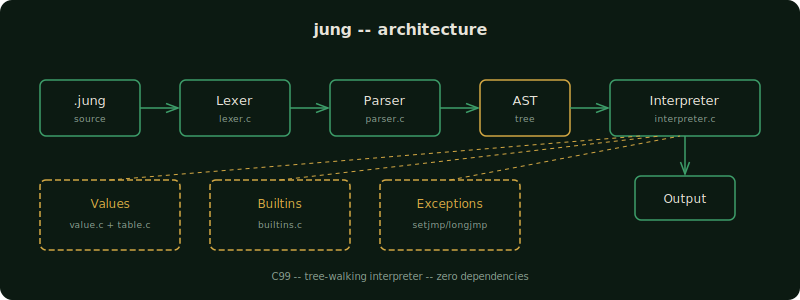

# jung

**A programming language for the collective unconscious.**

Jung is a tree-walking interpreter built on Jungian archetypes. Written in C99 with zero dependencies, it maps programming concepts to analytical psychology. Variables become perceptions. Functions become dreams. Classes become archetypes. The entry point is individuation.



## Build

```
make clean && make
./jung examples/hello.jung
```

## Keywords

All Jungian keywords have standard equivalents. Both forms work interchangeably.

| Jung | Standard | Concept |
|------|----------|---------|
| `perceive` | `let` | Become aware of a value |
| `dream` | `fn` | A message from the unconscious |
| `individuation` | `fn` | The journey of becoming |
| `archetype` | `class` | Define a universal pattern |
| `emerge` | `new` | Arise from the unconscious |
| `Self` | `this` | The unified whole |
| `project` | `print` | Express to the outside world |
| `manifest` | `return` | Make conscious |
| `unconscious` | `null` | The unknown |
| `integrate` | `import` | Absorb external wisdom |
| `confront` | `try` | Face the shadow |
| `embrace` | `catch` | Accept what you find |
| `reject` | `throw` | Cast into the unconscious |

## Features

- **Full expression system**: arithmetic, string concatenation, interpolation, ternary
- **Integer division**: `10 / 3` returns `3`, not `3.33333`
- **Control flow**: if/else, while, for-in, break, continue
- **Functions**: first-class, recursion, default parameters, closures
- **Classes**: constructor (`init`), methods, `Self`/`this` property access
- **Compound assignment**: `+=`, `-=`, `*=`, `/=` on variables and object properties
- **Error handling**: try/catch/throw with proper nested propagation
- **Data structures**: arrays, objects, string/array methods
- **Builtins**: len, range, split, join, slice, sort, reverse, math functions, type introspection
- **String interpolation**: `"Name: ${name}, Age: ${age}"`
- **File I/O**: readFile, writeFile, appendFile

## Example

```
# hello.jung

dream greet(name) {
    project "Hello, " + name
}

greet("World")
project "The journey of individuation begins."
```

```
# archetypes

archetype Hero {
    fn init(name) {
        Self.name = name
    }
    fn quest() {
        manifest Self.name + " embarks"
    }
}

perceive h = emerge Hero("Jung")
project h.quest()
```

## Tests

```
bash tests/run.sh
```

8 test suites: basics, classes, control flow, errors, functions, jungian keywords, arrays/objects, builtins.

## Architecture

Tree-walking interpreter. Source goes through three stages:

1. **Lexer** (`lexer.c`) -- tokenizes source into a flat token stream
2. **Parser** (`parser.c`) -- builds an AST from tokens
3. **Interpreter** (`interpreter.c`) -- walks the AST and evaluates

Support modules: `value.c` (value types, refcounting), `table.c` (hash table), `builtins.c` (standard library). Exception handling uses `setjmp`/`longjmp`.

~4100 LOC of C99, zero external dependencies.

---

*"Until you make the unconscious conscious, it will direct your life and you will call it fate."* -- Carl Jung
